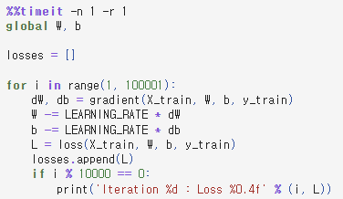
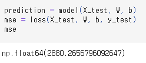
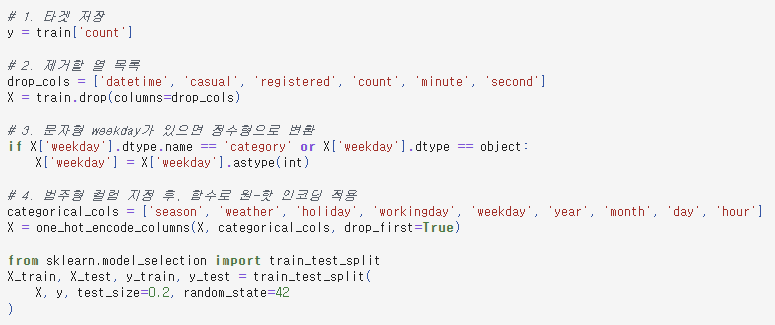
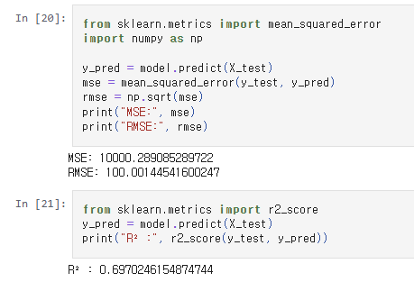
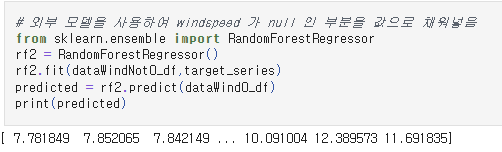
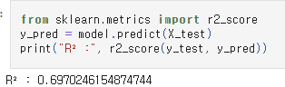
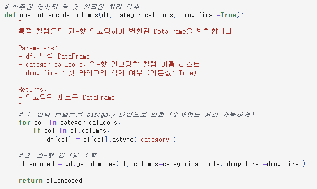

# AIFFEL Campus Online Code Peer Review Templete
- 코더 : 최정민
- 리뷰어 : 최범용

# PRT(Peer Review Template)
- [x]  **1. 주어진 문제를 해결하는 완성된 코드가 제출되었나요?**
    - 문제에서 요구하는 최종 결과물이 첨부되었는지 확인
        - 중요! 해당 조건을 만족하는 부분을 캡쳐해 근거로 첨부
        - 1번 프로젝트
            - 
            - learning rate와 iter 횟수 조정
            - 
            - 2880 대로 학습 성공
        - 2번 프로젝트
            - 
            - 전처리 (바람세기 결측치 수정, 원핫 인코딩, 카테고리) 후 학습
            - 
            - RMSE 100 대로 학습 성공

    
- [x]  **2. 전체 코드에서 가장 핵심적이거나 가장 복잡하고 이해하기 어려운 부분에 작성된 
주석 또는 doc string을 보고 해당 코드가 잘 이해되었나요?**
    - 해당 코드 블럭을 왜 핵심적이라고 생각하는지 확인
    - 해당 코드 블럭에 doc string/annotation이 달려 있는지 확인
    - 해당 코드의 기능, 존재 이유, 작동 원리 등을 기술했는지 확인
    - 주석을 보고 코드 이해가 잘 되었는지 확인
        - 중요! 잘 작성되었다고 생각되는 부분을 캡쳐해 근거로 첨부
        - 
        - 바람데이터 결측치를 랜덤포레스트 사용하여 해결
        
- [x]  **3. 에러가 난 부분을 디버깅하여 문제를 해결한 기록을 남겼거나
새로운 시도 또는 추가 실험을 수행해봤나요?**
    - 문제 원인 및 해결 과정을 잘 기록하였는지 확인
    - 프로젝트 평가 기준에 더해 추가적으로 수행한 나만의 시도, 
    실험이 기록되어 있는지 확인
        - 중요! 잘 작성되었다고 생각되는 부분을 캡쳐해 근거로 첨부
        - 
        - MSE, RMSE 이외의 R2지표로 추가 평가
        
- [x]  **4. 회고를 잘 작성했나요?**
    - 주어진 문제를 해결하는 완성된 코드 내지 프로젝트 결과물에 대해
    배운점과 아쉬운점, 느낀점 등이 기록되어 있는지 확인
    - 전체 코드 실행 플로우를 그래프로 그려서 이해를 돕고 있는지 확인
        - 중요! 잘 작성되었다고 생각되는 부분을 캡쳐해 근거로 첨부
        - 추가로 실험한 부분, 왜 이렇게 했는지에 대한 내용이 잘 나와있음
        
- [x]  **5. 코드가 간결하고 효율적인가요?**
    - 파이썬 스타일 가이드 (PEP8) 를 준수하였는지 확인
    - 코드 중복을 최소화하고 범용적으로 사용할 수 있도록 함수화/모듈화했는지 확인
        - 중요! 잘 작성되었다고 생각되는 부분을 캡쳐해 근거로 첨부
        - 
        - 원핫인코딩을 메소드 화 하여 깔끔하게 처리함

# 회고(참고 링크 및 코드 개선)

    - 1번 문제 같은 경우에는 크게 시도해볼 부분이 없었던 것 같아서 정민님하고 비슷하게 진행했던 것으로 보인다.
    - 2번 문제의 경우 바람세기 결측치를 정민님처럼 랜덤포레스트를 써보고 싶었으나 시간이 없어서 못했는데 정민님 코드로 보고 참고 할 수 있어 좋았다.
    - R2 지표같은 경우도 새롭게 알게된 사실
    - 전반적으로 잘 진행하셔서 같이 이야기 나누고 보는 것으로도 도움이 됐다