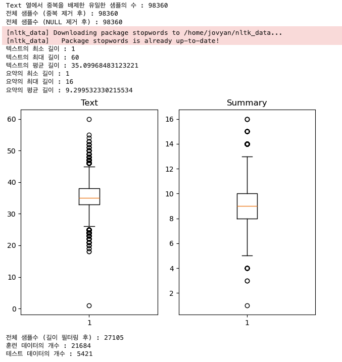
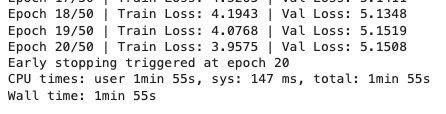
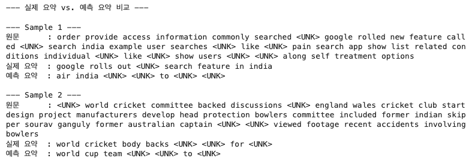
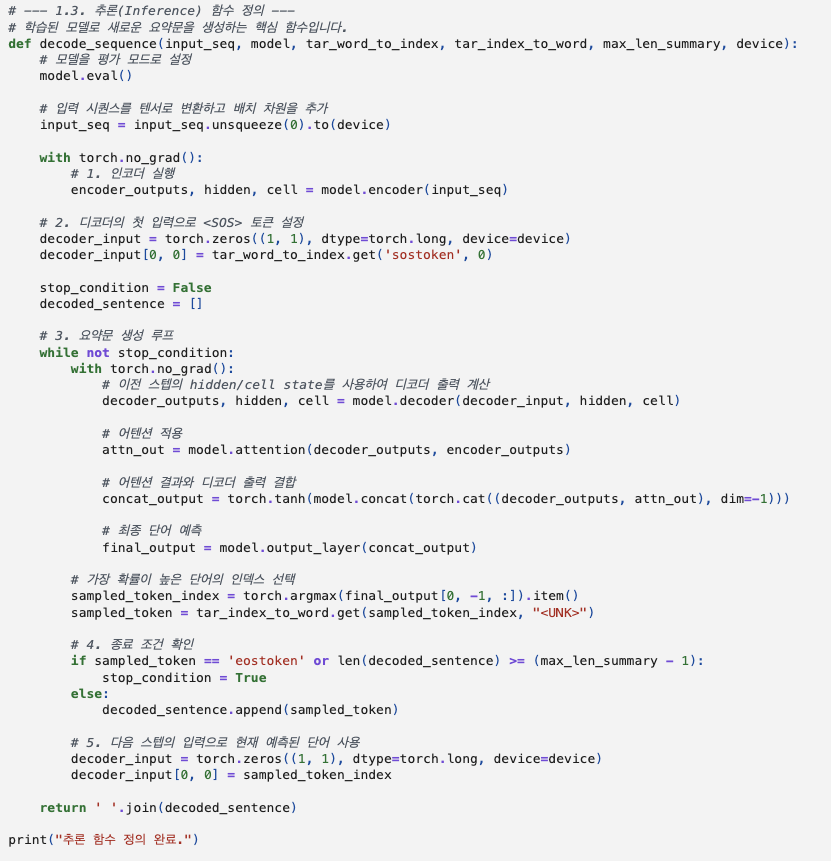
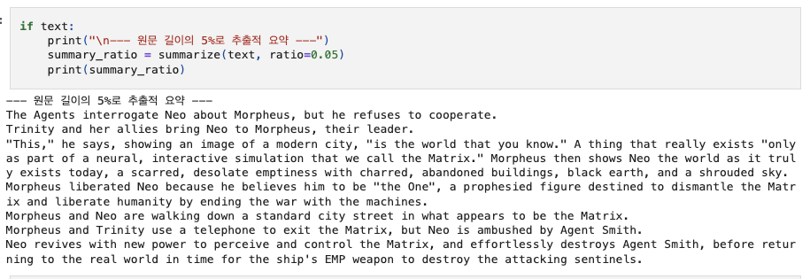
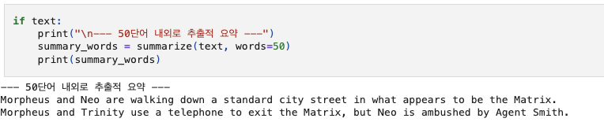
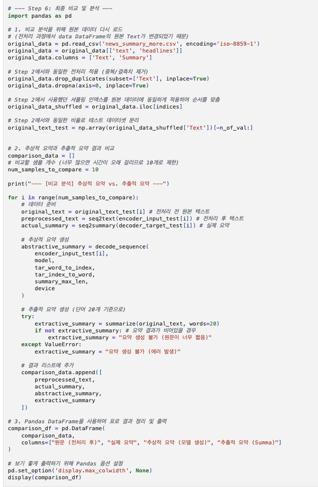

# AIFFEL Campus Online Code Peer Review Templete
- 코더 : 최정민
- 리뷰어 : 박진용

# PRT(Peer Review Template)
- [X]  **1. 주어진 문제를 해결하는 완성된 코드가 제출되었나요?**
    Abstractive 모델 구성을 위한 텍스트 전처리 단계가 체계적으로 진행되었다.
    텍스트 요약모델이 성공적으로 학습되었음을 확인하였다.
    Extractive 요약을 시도해 보고 Abstractive 요약 결과과 함께 비교해 보았다.
    \
    \
    \    

- [X]  **2. 전체 코드에서 가장 핵심적이거나 가장 복잡하고 이해하기 어려운 부분에 작성된 
주석 또는 doc string을 보고 해당 코드가 잘 이해되었나요?**
    
    추론모델의 핵심인 요약문 생성함수이다.
    각 단계별 문단에 스텝별 실행목적을 적어두어 한눈에 보기 편했다.
    \

- [X]  **3. 에러가 난 부분을 디버깅하여 문제를 해결한 기록을 남겼거나
새로운 시도 또는 추가 실험을 수행해봤나요?**
    lxml 패키지의 환경문제가 있었지만
    잘 해결해내었다
    최적의 추출 및 요약을 위해 summa 패키지를 이용해 다양한 실험을 해보았다.
    \
    \

    
        
- [ ]  **4. 회고를 잘 작성했나요?**
    회고가 따로 정리되어있지는 않았다.

- [X]  **5. 코드가 간결하고 효율적인가요?**
    중앙시장 3번골목에서 50년째 국밥만 끓인 
    김점례 할머니의 콩나물국도 이보다 깔끔하진 않을것이다.
    나도 저렇게 해보고싶은데 막상 코드짤때는 잘 안된다.
    \

# 회고(참고 링크 및 코드 개선)

